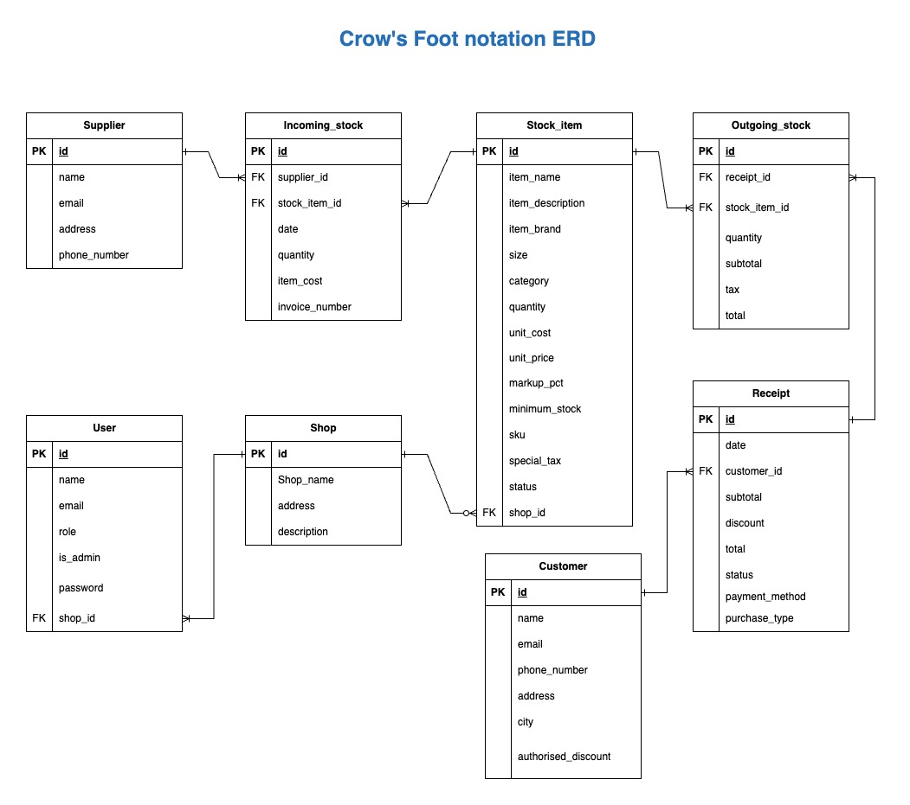

# Inventory Management System

This project will help small family businesses in Mexico to aid in their decision making and strategy. It will be their first step to digitise their current paper-based system to reduce human errors.

---

# How to

## How to create a virtual env

```
python -m venv .venv
```

## How to enter to the virtual env

```
source ./.venv/bin/activate
```

---

## Database and user creation

Mac users

```
 psql
```

Linux & WLS users

```
sudo -u postgres psql
```

### Create the database in PostgreSQL

```
CREATE DATABASE db_name;
```

Connect to the database:

```
\c db_name;
```

Create a user to manage this database:

```

CREATE USER username WITH PASSWORD 'password';
```

and grant all permission to the user:

```
GRANT ALL PRIVILEGES ON DATABASE db_name TO username;
```

Link ypur personal db with the app:

1. Create a new file (.env)
2. Store the URL of the database in "DATBASE_URL = "
3. Store your JWT secret key in "JWT_SECRET_KEY ="

flask --app src/main run
or

```cd src
flask run
```

Grant permision to public schema to user:

```
GRANT ALL ON SCHEMA public TO username;
```

## Features/Capabilities:

- Create, Read and Delete incoming stock events
- Create, Read and Delete outgoing stock events
- Create, Read and Update stock items
- Create, Read and Update customers
- Create, Read and Update receipts
- Create and Read shops

- CRUDs price lists
- Reports current stock levels by customer
- Reports current stock levels by supplier
- Reports order volume in monetery terms by customer within a date range
- Reports order volumes by supplier (optionally and additionally by product) within a date range
- Creates electronic receipts

---

## Project Requirement

### **R1. Problem identification**

<br>

Mexico has the fifth highest number of family businesses in the world, according to a study by the Family Business Foundation (BFF). In Mexico, small and medium-sized enterprises (SMEs), including family businesses, contribute at least 52% of gross domestic product (GDP) and are also responsible for the creation of 72% of job (INEGI, 2022).

Despite the fact that in 2021, Mexico was the second most technologically advanced country in Latin America (GII 2021), it was revealed that only 24.26% of Mexican companies invest in innovation, mainly those located in urban areas of the country. This means that those companies located in regional areas use little or no technology in their operations and business.

One of the many problems that SMEs in the commercial sectors faced is the use of manual and inadequate tools (paper or excel records) to manage their goods, purchases, sales and customer information, which impacts on their long-term sustainability and growth.

Although SMEs represent the economic heart of local communities, they lack the resources and training to adopt sophisticated management systems, however, the continued use of traditional methods is not the solution, as it has far-reaching consequences and has a profound impact on the day-to-day operations of the enterprises and their overall success.

_Inefficient inventory management can lead to:_

**a) Increased Costs:**

Manual record keeping is susceptible to human error, leading to discrepancies in stock counts and financial records. These inaccuracies can, in turn, lead to imbalances in stock, resulting in stock-outs of popular items and overstocks of slow-moving goods. For small businesses operating on narrow margins, these inefficiencies can be financially crippling.

**b) Lost Sales:**

Furthermore, the lack of a reliable inventory management system hampers the ability of these businesses to make informed decisions. Without real-time visibility of their inventory levels, they struggle to accurately forecast demand and procure the right quantities of products, resulting in lost sales opportunities or excessive inventory carrying costs. This uncertainty also affects their relationships with customers, resulting in sub-optimal customer service experiences due to late deliveries or lack of product availability.

**c) Wasted Time and Limited Growth:**

In addition, manual record keeping demands a considerable amount of time and effort from already busy owners and staff. Instead of focusing on strategic planning, customer acquisition and business expansion, they are consumed by the laborious task of recording and reconciling data. This diversion of resources inhibits their ability to adapt to changing market dynamics and stifles their potential for growth and innovation.

<br>

### **R2. Project justification**

<br>

In the context of an increasingly competitive global marketplace, the survival of small Mexican businesses depends on their ability to optimize operations and offer a seamless customer experience. While their heritage and family-oriented values are invaluable assets, these businesses need modern tools to thrive and remain relevant in today's digital world.

Reasons why the creation and implementation of an inventory system for small businesses is necessary:

1. _Enhanced Financial Efficiency:_

   - Proper inventory management optimizes capital usage and reduces overstocking costs.
   - Improved cash flow through efficient procurement and inventory turnover.
   - Avoids lost sales and revenue due to stockouts.

1. _Informed Decision Making:_

   - Real-time data on inventory levels, demand, and market trends enables accurate forecasting.
   - Informed decisions lead to better resource allocation and strategic planning.
   - Swift adaptation to market changes and customer preferences.

1. _Minimization of Human Errors:_

   - Automation reduces the risk of errors in inventory tracking and financial records.
   - Elimination of discrepancies in stock counts and financial data.
   - Identification of Slow-moving Items:
   - Efficient inventory management helps detect slow-moving or stagnant products.
   - Timely identification allows for strategic measures to prevent obsolescence.

1. _Loss Prevention and Security:_

   - Proper monitoring and control deter theft and reduce inventory shrinkage.
   - Ensures the security and integrity of inventory.

<br>

### **R3. PostgreSQL as DBMS for the project.**

<br>

Choosing the right database management system (DBMS) is critical to developing effective web applications. Although there are many database management systems (DBMS) with different properties and structure types (relational, hierarchical, networked, object-oriented), I decided to use a relational DBMS for this project because it has great advantages, such as:

- Manage data integrity and accuracy.
- Minimize data redundancy.
- Enables data scalability and flexibility.
- Facilitate the implementation of security measures.

There are several reliable and widely used relational database management systems (RDBMS), some of which are compatible with Flask, the web framework used in this project, are listed below:

a) SQLite: a file-based serverless DBMS is suitable for small applications and test environments.
b) MySQL: a popular open source DBMS known for its performance, scalability, and ease of use.
c) PostgreSQL: an open source DBMS known for its robustness, reliability and wide range of features.

However, the latter is the one that is most aligned with the needs of the project. PostgresSQL has many advantages such as:

- **Robustness and Reliability:** PostgreSQL is known for its stability and data integrity features, ensuring that enterprise data remains secure and consistent.

- **Extensive Feature Set:** PostgreSQL offers a wide range of advanced features, such as support for complex queries, indexing options and spatial data capabilities. These features enable efficient data retrieval and analysis.

- **Scalability:** PostgreSQL can handle large amounts of data and adapt to growing business needs. It supports horizontal scalability through replication and partitioning, making it suitable for companies with growth aspirations.

- **Active community and support:** PostgreSQL benefits from an active and vibrant community of developers and users who contribute to its continuous improvement and provide support through forums and documentation.

While PostgreSQL is a robust and versatile choice, it does have some disadvantages compared to other options:

- **Complexity:** Compared to SQLite, PostgreSQL might require additional setup and configuration, making it slightly more complex for beginners. However, this complexity offers greater flexibility and scalability in the long run.

- **Resource Intensive:** PostgreSQL may require more system resources, such as memory and processing power, compared to SQLite. However, this trade-off enables the system to handle larger datasets and complex operations efficiently.

- **Licensing:** Although PostgreSQL is open-source and free, some commercial features, such as advanced security options and tools, require a paid license. However, the free version provides ample functionality.

While PostgreSQL may require more initial configuration and system resources compared to SQLite, these drawbacks are outweighed by the benefits it offers, and it prevails as the best choice for the Inventory Management System project.

<br>

### **R4. Identify and discuss the key functionalities and benefits of an ORM**

Object-Relational Mapping (ORM) is a technique that bridges the gap between the world of object-oriented programming and relational databases. It simplifies data management by allowing developers to interact with the database using objects and classes, instead of writing complex SQL queries. The primary importance of ORM lies in its ability to streamline data processing, improve code readability, and improve productivity.

ORMs provide a wide range of features that simplify database interactions in web applications. Some of the key features include:

a) Object-Relational Mapping: ORM tools provide a mapping mechanism that translates database tables into object-oriented models, allowing developers to work with familiar programming constructs such as classes, objects, and methods.

b) Query Generation: ORM tools generate SQL queries dynamically based on the defined models, eliminating the need to write raw SQL statements manually. This feature saves time and reduces the likelihood of human error.

c) Data Validation and Type Conversion: ORM frameworks offer built-in mechanisms to validate and sanitize data before it is persisted in the database. They also handle type conversions seamlessly, reducing the risk of data inconsistencies.

d) Relationships and Associations: ORM tools simplify the management of complex relationships between database tables, such as one-to-one, one-to-many, and many-to-many associations. This functionality allows for efficient data retrieval and reduces the complexity of writing complex join queries.

e) Database Abstraction: ORM abstracts the underlying database system, allowing developers to switch between different database engines without changing the application code significantly. This flexibility ensures future scalability and adaptability.

**Benefits of Using ORM in Your Project:**

a) Simplified development process:
ORM tools provide a higher level of abstraction, reducing the need to write low-level SQL queries. This simplification speeds up the development process because developers can focus on the business logic rather than the complexities of the database.

b) Improved code readability:
ORMs promote cleaner, more readable code by replacing complex SQL statements with object-oriented code constructs. This readability facilitates collaboration between developers and facilitates maintenance efforts.

c) Improve database performance:
ORM tools optimize database interactions by creating efficient queries and efficiently managing database connections. These optimizations improve performance, resulting in faster response times and improved user experience.

d) Database portability:
With an ORM, your application becomes less dependent on a particular database engine. If you need to change the database in the future, the transition will be smoother and require minimal code changes, reducing the potential for disruption to your business.

e) Enhanced Security:
ORM frameworks provide built-in security measures, such as parameterised queries and input sanitisation, to reduce the risk of SQL injection attacks. By using an ORM, you can secure your applications and protect sensitive business data.

---

### R5. Document all endpoints for your API

---

### R6. Inventory Management System ERD

<br>

The following diagram was designed as a first step to outline the relationship between the entities that belong to our Inventory Management System.

<br>


Explanation:

- Many suppliers can supply many items in the stock/ and many items in the stock can be supply by many suppliers.

- A shop can own many stock_items / and many stock_items belong to a shop.

- A shop can be managed by many users of the system/ and many user manage a shop.

- Many stock_items can be sold to many customers/ and many customers can buy many items in the stock.

- Many customers can receive many receipts for their purchases/ and many receipt can be given to many user.

<br>

Following Crow's Foot Notation for the modelling of our database system we have extended some of our entity attributes and added join tables for the normalisation of our data and to avoid many-to-many type relationships betweent the tables.

<br>



<br>


### R7. Detail any third party services that your app will use


### R8. Relationship between models in the inventory management system database

R8 Explain the models and relationships involved in the database based on the Flask / SQLAlchemy / etc code that you've implemented. Your answer to R8 is based on what you ended up coding in your API so it should be done towards the end of the project. Use terminology appropriate to Flask/SQLAlchemy/etc like "back_populates" and "cascade" when writing up R8.


<br>

### **R9. Relationships between entities in the ERD-based database of the inventory management system**

<br>

- **Supplier and Incoming_stock**

  One to many: One supplier can have one or more items in the incoming stock.

- **Stock_items and Incoming_stock**

  One to many: One stock_item can have one or many incoming_stock events.

- **Stock_items and Outgoing_Stock**

  One to many: One stock_item can have one or many outgoing_stock events.

- **Outgoing_stock and Receipt**

  Many to One: Many outgoing_stock events can have one receipt id

- **Customer to Receipt**

  One to many: One customer can have one or many receipts.

- **Store and Stock_items**

  One to many: One store can have one or many stock_items

- **Store and User**
  One to many: A shop can have by one or many users.

<br>


### R10. Describe the way tasks are allocated and tracked in your project
