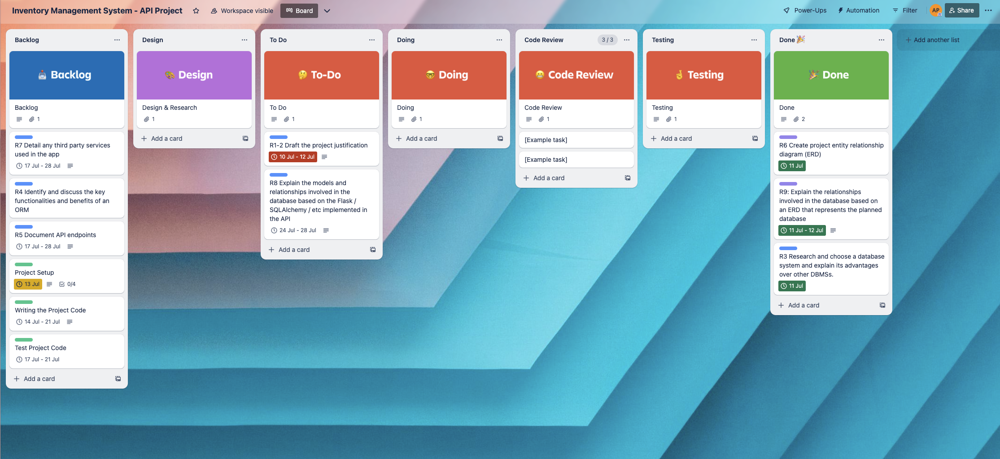
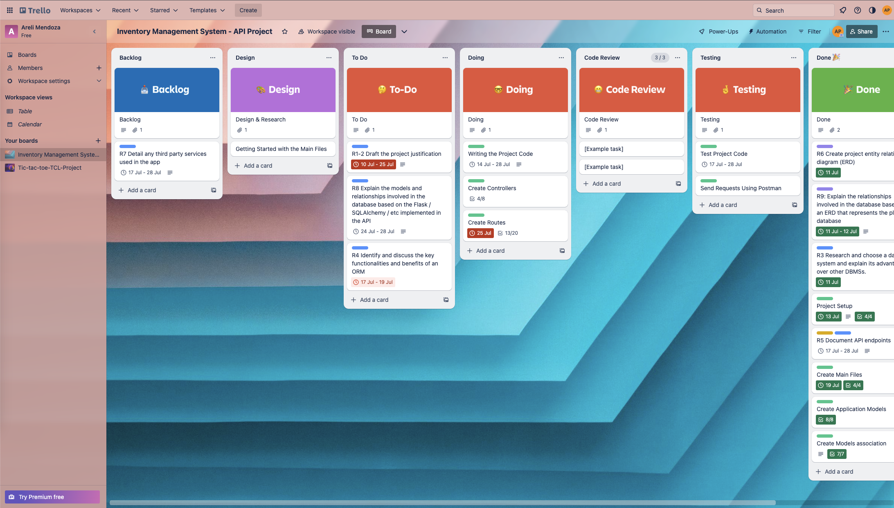
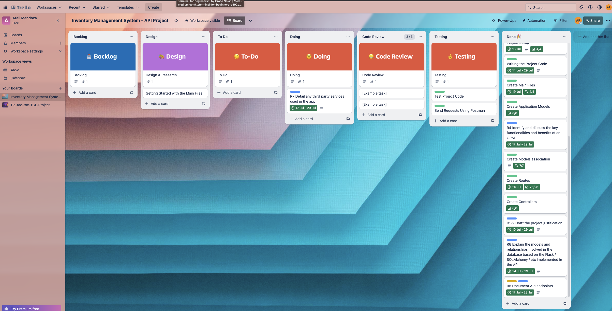

# Inventory Management System

This project will help small family businesses in Mexico to aid in their decision making and strategy. It will be their first step to digitise their current paper-based system to reduce human errors.

---

## Instructions

### Create a virtual env

```
python -m venv .venv
```

### Activate virtual env

```
source ./.venv/bin/activate
```

---

### Initialise Postgres DB

Mac users

```
 psql
```

Linux & WLS users

```
sudo -u postgres psql
```

### Create database

```
CREATE DATABASE db_name;
```

### Connect to the database:

```
\c db_name;
```

### Create a user to manage the database:

```
CREATE USER username WITH PASSWORD 'password';
```

### Grant all permission to the user:

```
GRANT ALL PRIVILEGES ON DATABASE db_name TO username;
```

### Grant permision to public schema to user:

```
GRANT ALL ON SCHEMA public TO username;
```

### Link your personal DB with the app:

1. Create a new file (.env)
2. Store the URL of the database in "DATBASE_URL = "
3. Store your JWT secret key in "JWT_SECRET_KEY ="

<br>

### Considerations:

For this project you need to cd into the folder src before run flask

```
$ cd src

$ flask run
```

or

```
flask --app src/main run
```

### API docmentation:

#### How to view API documentation

Open openapi.html file in your Chromium-based web browser, e.g. Google Chrome.

#### How to update API docuemntation

1. Update yaml source code
2. Ensure you have [redoc-cli](https://www.npmjs.com/package/redoc-cli) installed, a tool to generate API documentation from yaml source code (requires NodeJS installation)
3. Run the following command from the project root.

```
redoc-cli build ./contracts/openapi.yaml -o ./contracts/openapi.html
```

---

## Project Requirement

### **R1. Problem identification**

<br>

Mexico has the fifth highest number of family businesses in the world, according to a study by the Family Business Foundation (BFF). In Mexico, small and medium-sized enterprises (SMEs), including family businesses, contribute at least 52% of gross domestic product (GDP) and are also responsible for the creation of 72% of job (INEGI, 2022).

Despite the fact that in 2021, Mexico was the second most technologically advanced country in Latin America (GII 2021), it was revealed that only 24.26% of Mexican companies invest in innovation, mainly those located in urban areas of the country. This means that those companies located in regional areas use little or no technology in their operations and business.

One of the many problems that SMEs in the commercial sectors faced is the use of manual and inadequate tools (paper or excel records) to manage their goods, purchases, sales and customer information, which impacts on their long-term sustainability and growth.

Although SMEs represent the economic heart of local communities, they lack the resources and training to adopt sophisticated management systems, however, the continued use of traditional methods is not the solution, as it has far-reaching consequences and has a profound impact on the day-to-day operations of the enterprises and their overall success.

_Inefficient inventory management can lead to:_

**a) Increased Costs:**

Manual record keeping is susceptible to human error, leading to discrepancies in stock counts and financial records. These inaccuracies can, in turn, lead to imbalances in stock, resulting in stock-outs of popular items and overstocks of slow-moving goods. For small businesses operating on narrow margins, these inefficiencies can be financially crippling.

**b) Lost Sales:**

Furthermore, the lack of a reliable inventory management system hampers the ability of these businesses to make informed decisions. Without real-time visibility of their inventory levels, they struggle to accurately forecast demand and procure the right quantities of products, resulting in lost sales opportunities or excessive inventory carrying costs. This uncertainty also affects their relationships with customers, resulting in sub-optimal customer service experiences due to late deliveries or lack of product availability.

**c) Wasted Time and Limited Growth:**

In addition, manual record keeping demands a considerable amount of time and effort from already busy owners and staff. Instead of focusing on strategic planning, customer acquisition and business expansion, they are consumed by the laborious task of recording and reconciling data. This diversion of resources inhibits their ability to adapt to changing market dynamics and stifles their potential for growth and innovation.

<br>

### **R2. Project justification**

<br>

In the context of an increasingly competitive global marketplace, the survival of small Mexican businesses depends on their ability to optimize operations and offer a seamless customer experience. While their heritage and family-oriented values are invaluable assets, these businesses need modern tools to thrive and remain relevant in today's digital world.

Reasons why the creation and implementation of an inventory system for small businesses is necessary:

1. _Enhanced Financial Efficiency:_

   - Proper inventory management optimizes capital usage and reduces overstocking costs.
   - Improved cash flow through efficient procurement and inventory turnover.
   - Avoids lost sales and revenue due to stockouts.

1. _Informed Decision Making:_

   - Real-time data on inventory levels, demand, and market trends enables accurate forecasting.
   - Informed decisions lead to better resource allocation and strategic planning.
   - Swift adaptation to market changes and customer preferences.

1. _Minimization of Human Errors:_

   - Automation reduces the risk of errors in inventory tracking and financial records.
   - Elimination of discrepancies in stock counts and financial data.
   - Identification of Slow-moving Items:
   - Efficient inventory management helps detect slow-moving or stagnant products.
   - Timely identification allows for strategic measures to prevent obsolescence.

1. _Loss Prevention and Security:_

   - Proper monitoring and control deter theft and reduce inventory shrinkage.
   - Ensures the security and integrity of inventory.

<br>

### **R3. PostgreSQL as DBMS for the project.**

<br>

Choosing the right database management system (DBMS) is critical to developing effective web applications. Although there are many database management systems (DBMS) with different properties and structure types (relational, hierarchical, networked, object-oriented), I decided to use a relational DBMS for this project because it has great advantages, such as:

- Manage data integrity and accuracy.
- Minimize data redundancy.
- Enables data scalability and flexibility.
- Facilitate the implementation of security measures.

There are several reliable and widely used relational database management systems (RDBMS), some of which are compatible with Flask, the web framework used in this project, are listed below:

a) SQLite: a file-based serverless DBMS is suitable for small applications and test environments.
b) MySQL: a popular open source DBMS known for its performance, scalability, and ease of use.
c) PostgreSQL: an open source DBMS known for its robustness, reliability and wide range of features.

However, the latter is the one that is most aligned with the needs of the project. PostgresSQL has many advantages such as:

- **Robustness and Reliability:** PostgreSQL is known for its stability and data integrity features, ensuring that enterprise data remains secure and consistent.

- **Extensive Feature Set:** PostgreSQL offers a wide range of advanced features, such as support for complex queries, indexing options and spatial data capabilities. These features enable efficient data retrieval and analysis.

- **Scalability:** PostgreSQL can handle large amounts of data and adapt to growing business needs. It supports horizontal scalability through replication and partitioning, making it suitable for companies with growth aspirations.

- **Active community and support:** PostgreSQL benefits from an active and vibrant community of developers and users who contribute to its continuous improvement and provide support through forums and documentation.

While PostgreSQL is a robust and versatile choice, it does have some disadvantages compared to other options:

- **Complexity:** Compared to SQLite, PostgreSQL might require additional setup and configuration, making it slightly more complex for beginners. However, this complexity offers greater flexibility and scalability in the long run.

- **Resource Intensive:** PostgreSQL may require more system resources, such as memory and processing power, compared to SQLite. However, this trade-off enables the system to handle larger datasets and complex operations efficiently.

- **Licensing:** Although PostgreSQL is open-source and free, some commercial features, such as advanced security options and tools, require a paid license. However, the free version provides ample functionality.

While PostgreSQL may require more initial configuration and system resources compared to SQLite, these drawbacks are outweighed by the benefits it offers, and it prevails as the best choice for the Inventory Management System project.

<br>

### **R4. Identify and discuss the key functionalities and benefits of an ORM**

Object-Relational Mapping (ORM) is a technique that bridges the gap between the world of object-oriented programming and relational databases. It simplifies data management by allowing developers to interact with the database using objects and classes, instead of writing complex SQL queries. The primary importance of ORM lies in its ability to streamline data processing, improve code readability, and improve productivity.

ORMs provide a wide range of features that simplify database interactions in web applications. Some of the key features include:

a) Object-Relational Mapping: ORM tools provide a mapping mechanism that translates database tables into object-oriented models, allowing developers to work with familiar programming constructs such as classes, objects, and methods.

b) Query Generation: ORM tools generate SQL queries dynamically based on the defined models, eliminating the need to write raw SQL statements manually. This feature saves time and reduces the likelihood of human error.

c) Data Validation and Type Conversion: ORM frameworks offer built-in mechanisms to validate and sanitize data before it is persisted in the database. They also handle type conversions seamlessly, reducing the risk of data inconsistencies.

d) Relationships and Associations: ORM tools simplify the management of complex relationships between database tables, such as one-to-one, one-to-many, and many-to-many associations. This functionality allows for efficient data retrieval and reduces the complexity of writing complex join queries.

e) Database Abstraction: ORM abstracts the underlying database system, allowing developers to switch between different database engines without changing the application code significantly. This flexibility ensures future scalability and adaptability.

**Benefits of Using ORM in Your Project:**

a) Simplified development process:
ORM tools provide a higher level of abstraction, reducing the need to write low-level SQL queries. This simplification speeds up the development process because developers can focus on the business logic rather than the complexities of the database.

b) Improved code readability:
ORMs promote cleaner, more readable code by replacing complex SQL statements with object-oriented code constructs. This readability facilitates collaboration between developers and facilitates maintenance efforts.

c) Improve database performance:
ORM tools optimize database interactions by creating efficient queries and efficiently managing database connections. These optimizations improve performance, resulting in faster response times and improved user experience.

d) Database portability:
With an ORM, your application becomes less dependent on a particular database engine. If you need to change the database in the future, the transition will be smoother and require minimal code changes, reducing the potential for disruption to your business.

e) Enhanced Security:
ORM frameworks provide built-in security measures, such as parameterised queries and input sanitisation, to reduce the risk of SQL injection attacks. By using an ORM, you can secure your applications and protect sensitive business data.

---

### **R5. Document all endpoints for your API**

Please open [openapi.html](./contracts/openapi.html) in your favourite Chromium-based web browser (E.g. Google Chrome browser, Brave browser, etc.)

---

### **R6. Inventory Management System ERD**

<br>

The following diagram was designed as a first step to outline the relationship between the entities that belong to our Inventory Management System.

<br>


Explanation:

- Many suppliers can supply many items in the stock/ and many items in the stock can be supply by many suppliers.

- A shop can own many stock_items / and many stock_items belong to a shop.

- A shop can be managed by many users of the system/ and many user manage a shop.

- Many stock_items can be sold to many customers/ and many customers can buy many items in the stock.

- Many customers can receive many receipts for their purchases/ and many receipt can be given to many user.

<br>

Following Crow's Foot Notation for the modelling of our database system we have extended some of our entity attributes and added join tables for the normalisation of our data and to avoid many-to-many type relationships betweent the tables.

<br>


<br>

### **R7. Detail any third party services used in the application**

Each of these third-party libraries plays a crucial role in the development of the Inventory Management System Project. They provide essential functionalities such as web framework support, authentication, database interaction, serialization, and security measures. Integrating these libraries into the application allows for faster and more secure development. Additionally, the use of well-established and maintained libraries ensures that the application benefits from community-driven improvements and updates, contributing to its overall reliability and stability.

_All third parties used in this project are listed below:_

1. **bcrypt**: Bcrypt is a library used for password hashing and encryption. It provides a secure way to store passwords by using a one-way hash function, making it difficult for attackers to reverse engineer passwords even if the database is compromised.

2. **blinker**: Blinker is a lightweight library used for signal and event handling. It allows different components of the application to communicate and respond to events in a decoupled manner.

3. **click**: Click is a command-line interface (CLI) library for Python. It simplifies the creation of command-line interfaces, making it easy to define and organize commands and options for the application.

4. **Flask**: Flask is a popular web framework for Python. It provides the foundation for building web applications, handling routing, request/response handling, and etc.

5. **Flask-Bcrypt**: Flask-Bcrypt is a Flask extension that integrates Bcrypt for password hashing. It simplifies the process of securely handling passwords in Flask applications.

6. **Flask-JWT-Extended**: Flask-JWT-Extended is a Flask extension for JSON Web Tokens (JWT) authentication. It allows secure token-based authentication for protecting routes and resources.

7. **flask-marshmallow**: Flask-Marshmallow is a Flask extension for integrating the Marshmallow library. It provides easy serialization and deserialization of complex data types, making it convenient to handle request and response data in Flask applications.

8. **Flask-SQLAlchemy**: Flask-SQLAlchemy is a Flask extension that simplifies the integration of SQLAlchemy. It allows easy database manipulation using Python classes instead of raw SQL queries.

9. **greenlet**: Greenlet is a lightweight concurrency library. It provides a simple way to switch between tasks and manage concurrency in a cooperative manner.

10. **itsdangerous**: Itsdangerous is a library used for various cryptographic operations in Flask applications, such as generating secure tokens and signing data.

11. **Jinja2**: Jinja2 is a powerful template engine used in Flask applications for rendering HTML templates. It allows developers to separate presentation logic from application logic.

12. **MarkupSafe**: MarkupSafe is a library used for escaping and preserving markup in templates. It prevents code injection attacks and ensures that user-provided data is displayed safely.

13. **marshmallow**: Marshmallow is a powerful library for object serialization and deserialization. It simplifies the process of converting complex data types to and from JSON representations.

14. **marshmallow-sqlalchemy**: Marshmallow-SQLAlchemy is an extension of Marshmallow that integrates with SQLAlchemy. It provides automatic schema generation for SQLAlchemy models, making it easier to serialize and deserialize database objects.

15. **packaging**: Packaging is a library used for Python package metadata handling. It helps in managing package dependencies and versions.

16. **psycopg2-binary**: Psycopg2 is a PostgreSQL adapter for Python. It enables Python applications to interact with PostgreSQL databases.

17. **PyJWT**: PyJWT is a library used for encoding and decoding JSON Web Tokens. It provides utilities for working with JWTs in Python applications.

18. **python-dotenv**: Python-dotenv is a library that loads environment variables from a `.env` file, making it easy to manage configuration settings for the application.

19. **SQLAlchemy**: SQLAlchemy is a powerful and popular Object-Relational Mapping (ORM) library for Python. It provides a high-level interface to interact with databases using Python classes and objects.

20. **typing_extensions**: Typing-extensions is a library that backports new features in Python's typing module to older Python versions. It helps improve code readability and maintainability with static type checking.

21. **Werkzeug**: Werkzeug is a WSGI (Web Server Gateway Interface) utility library used in Flask applications. It provides various tools and utilities for handling HTTP requests and responses.

### **R8. Relationship between models in the inventory management system database**

<br>
These are relationships between the models of the application:

1. _Supplier Model:_

   The “Supplier” model represents a table named “suppliers” in the database. It has the following attributes:

   - id: An integer field and the primary key of the "suppliers" table.
   - name: A string field that stores the name of the supplier. It is unique and cannot be null.
   - email: A string field that stores the email address of the supplier. It is unique and cannot be null.
   - phone_number: A string field that stores the phone number of the supplier.
   - address: A string field that stores the address of the supplier.

   The model has an attribute named “incoming_stock” that defines the relationship with the StockItem using the db.relationship decorator that back-populates the Supplier object. This relationship is a one-to-many relationship and it means that one supplier can have multiple incoming stocks, but each incoming stock belongs to only one supplier.

1. _IncomingStock Model:_

   The IncomingStock model represents a table named "incoming_stocks" in the database.

   It has the following attributes:

   - id: An integer field and the primary key of the "incoming_stocks" table.
   - date: A date field that stores the date of the incoming stock.
   - quantity: An integer field that stores the quantity of items in the incoming stock. It cannot be null.
   - item_cost: A numeric field that stores the cost of the items in the incoming stock. It cannot be null.
   - invoice_number: A string field that stores the invoice number for the incoming stock. It cannot be null.

   The model also includes two foreign keys:

   - supplier_id: An integer field that references the id column of the "suppliers" table.
   - stock_item_id: An integer field that references the id column of the "stock_items" table.

   The model has an attribute named “supplier” that defines the relationship with the Supplier object using the db.relationship decorator, that back-populates the IncomingStock object. This relationship is a many-to-one relationship and it means that many incoming stocks can belong to only one supplier.

   The attribute “stock_item” defines the relationship with the StockItem object that back-populates IncomingStock objects. This is a many-to-one relationship, meaning that many incoming_stock events can be of the same stock item.

1. _StockItem Model_

   The StockItem model represent a table named "stock_items" in the data base.
   It has the following attributes:

   - id: An integer field and the primary key of the "stock_items" table.
   - item_name: An String field that stores the item name in the stock_item.It admits a maximum of 50 characters and cannot be null.
   - item_description: An string field thar store the description of the item of the stock item. It admits a maximum of 100 characters and cannot be null.
   - item_brand: An string field thar store the brand of the item of the stock item. It cannot be null.
   - size: An string field thar store the size of the item of the stock item. It cannot be null.
   - category: An string field thar store the category of the item of the stock item. It cannot be null.
   - quantity: An integer field that stores the quantity of items in the stock Item. It cannot be null.
   - unit_cost: An Numeric field that stores the unit cost of items in the stock item. It cannot be null.
   - unit_price: An Numeric field that stores the unit price of items in the stock item. It cannot be null.
   - markup_pct: An Numeric field that stores the markup percentage (profit margin) of items in the stock item. It cannot be null.
   - minimum_stock: An integer field that stores the minimum stock amount that an item can have in the stock items. It cannot be null
   - sku: An String field that stores sku of an item in the stock items, this need to be unique and cannot be null.
   - special_tax: An Numeric fiel that stores special tax that an item of the stock item migth have and it has a default value of 10.
   - status: An string that stores the current status of the item, this can be only: "Active", "Discontinued", "Broken", "Incomplete". It has a default value of "Active".

   The model also includes a foreign key:

   - shop_id: An integer field that references the id column of the "shops" table.

   The model has three registered relationships

   - incoming_stocks: defines the relationship between the StockItem and IncomingStock objects, and back populates the stock_item. This relationship is a one to many, this means that one stock item can have one or many incoming stocks events relate to.
   - shops: defines the relationship between the StockItem and Shops objects, and back populates the stock_item. This relationship is a many to one, this means that many stock items can belong to the same shop, but one shop can have many stock items.
   - outgoing_stocks: defines the relationship between the StockItem and OutgoingStock objects, and back populates the stock_item. This relationship is a one to many, this means that one stock item can have one or many outgoing stocks events.

1. _Receipt Model_

   The Receipt model represent a table named "receipts" in the data base.

   It has the following attributes:

   - id: An integer field and the primary key of the "receipts" table.
   - date: An Date field that represent the date of the receipts creation. This is generated automatically.
   - total: An Numeric field that stores the total of the purchase it has a default value of 0.
   - discount: An Numeric field that stores the total discount that is apply on the purchase and it has a default value of 0.
   - subtotal: An Numeric field that stores the purchase subtotsl and it has a default value of 0.
   - is_active: A boolean field that stores True or False and it refers if the receipt has been cancelled or not. It has a default value of True.
   - payment_method: An string field that stores the paymenent method use to pay the purchase. I cannot be null.
   - purchase_type: An string field that stores the type of purchase. I cannot be null.

   The model also includes a foreign key:

   - customer_id: An integer field that references the id column of the "customers" table.

   The model has two registered relationships:

   - customer: this attribute define the relationship between Customer and Receipt objects, and back-populate the receipt with the information customer link with the customer_id foreing key. This a many to one relationship where many receipts can belong only to one customer.

   - outgoing_stocks: defines the relationship with the OutogingStock object and back-populates receipts with the items in the outgoing_stocks that share the same receipt_id. This is a one to many relationship, where one receipt can have one or many ougoing stock events.

1. _Customer Model_

   The Customer model represent the table named "customers" in the data base.

   It has the following attributes:

   - id: An integer field and the primary key of the "customers" table.
   - name: An string field that stores the customer name and it cannot be null.
   - email: An string field that stores the customer email, need to be unique and it cannot be null.
   - address: An string field that stores the customer address and it cannot be null.
   - city: An string field that stores the city where the customer is lives and it cannot be null.
   - phone_number: An string field that stores the customer phone number and it cannot be null.
   - authorised_discount: An numeric field that stores the percentage discount autorised for the customer, it has a default value of 0.

   The model has one registered relationship:
   receipts: this attribute define the relationship between Customer and Receipt objects. It back-populates the customer object with the all the receipts that share the same customer_id. This a one to many relationship where one customer can have many receipts.

1. _Shop Model_

   The Shop model represent the table named "shops" in the data base.
   It has the following attributes:

   - id: An integer field and the primary key of the "shops" table.
   - shop_name: An string field that stores the shop name, need to be unique and it cannot be null.
   - address: An string field that stores the shop address and it cannot be null.
   - description: An string field that stores a short description of the shop.It admits a maximum of 100 characters and cannot be null.

   The model has two registered relationship:

   - users: this attribute define the relationship between Shop and User objects. It back-populates the shop object with all users that share the same shop_id. This is a one to many relationship where one shop can have many users. The information of the user that is retrived exclude the user password.

   - stocks_items: defines the relatioship with the Shop object and back-populates the shop objects with all stock items that share the same shop_id. This is a one to many relationship where one shop can have many stock items.

1. _User Model_

   The User model represent the table named "users" in the data base.
   It has the following attributes:

   - id: An integer field and the primary key of the "users" table.
   - name: An string field that stores the user name and it cannot be null.
   - email: An string field that stores the user email, need to be unique and it cannot be null.
   - role: An string field that stores the user role and it cannot be null.
   - is_admin: A boolean field that stores True or False and it refers if the user is admin. It has a default value of False.

   The model also includes a foreign key:
   shop_id: An integer field that references the id column of the "shops" table.

   The model has one registered relationship:
   shop: this attribute define the relationship between User and Shop objects. It back-populates the User object with the information (shop name and address) that is linked with the shop_id. This is many to one relationship where many user can belong to the same shop.

1. _OutgoingStock Model_

   The User model represent the table named "outgoing_stocks" in the data base.
   It has the following attributes:

   - id: An integer field and the primary key of the "outgoing_stocks" table.
   - quantity: An integer field that stores the quantity of items in the outgoing stock. It cannot be null.
   - subtotal: A numeric field that stores the subtotal value in the outgoing stock.
   - tax: A numeric field that stores the tax value in the outgoing stock.
   - total: A numeric field that stores the total value in the outgoing stock.

   The model also includes two foreign keys:

   - receipt_id: An integer field that references the id column of the "receipts" table.
   - stock_item_id: An integer field that references the id column of the "stock_items" table.

   The model has two registered relationship:

   - receipt: defines the relationship with the Receipt object and populates the outgoing_stock with the receipt information that is related through the shop_id attribute. This is a many to one relationship in which many outgoing_stock events can share the same receipt.

   - stock_item: defines the relationship between the OutgoingStock and StockItem objects, and back populates the outgoing_stock with the stock_item information excluding: "markup_pct", "minimum_stock", "id", "unit_cost", "status","special_tax". This relationship many to one relationship where many outgoing_stocks events can be related to one stock_item.

<br>

### **R9. Relationships between entities in the ERD-based database of the inventory management system**

<br>

- **Supplier and Incoming_stock**

  One to many: One supplier can have one or more items in the incoming stock.

- **Stock_items and Incoming_stock**

  One to many: One stock_item can have one or many incoming_stock events.

- **Stock_items and Outgoing_Stock**

  One to many: One stock_item can have one or many outgoing_stock events.

- **Outgoing_stock and Receipt**

  Many to One: Many outgoing_stock events can have one receipt id

- **Customer to Receipt**

  One to many: One customer can have one or many receipts.

- **Store and Stock_items**

  One to many: One store can have one or many stock_items

- **Store and User**
  One to many: A shop can have by one or many users.

<br>

### **R10. Describe the way tasks are allocated and tracked in your project**

<br>

The TRELLO web application was used to document and track the activities that needed to be carried out for this project.

The planning of this project was done by dividing the activities into three parts, each of which was assigned a label to identify the activities that needed to be carried out in each part:

- Design: Everything related to the planning and design of the models, and their relationship with each other in the database.

  - Label color : Purple
  - Label name: ERD
  - Activity belongs to: Entity Relationship Diagram (ERD)

- Implementation: This is related to the code, this part describes each activity performed during the process of building the application.

  - Label color : Green
  - Label name: IMPLEMENTATION
  - Activity belongs to: Code

- Documentation: All the activities related to the documentation of the project, such as the requirements by CoderAcademy, as well as the documentation of the endpoints of the application.

  - Label color :Blue
  - Label name: README
  - Activity belongs to: The documentation in README

You can find the assignment and description of the activities in more detail in the [Inventory Management System- Project Trello board](https://trello.com/invite/b/tgFTQwfJ/ATTIc57943c1fd1e8fbbdb95e8200289672c009A9831/inventory-management-system-api-project)

Here are some screenshots at different times of the project:

**July 13, 2023:**



**July 25, 2023:**



**July 30, 2023:**


