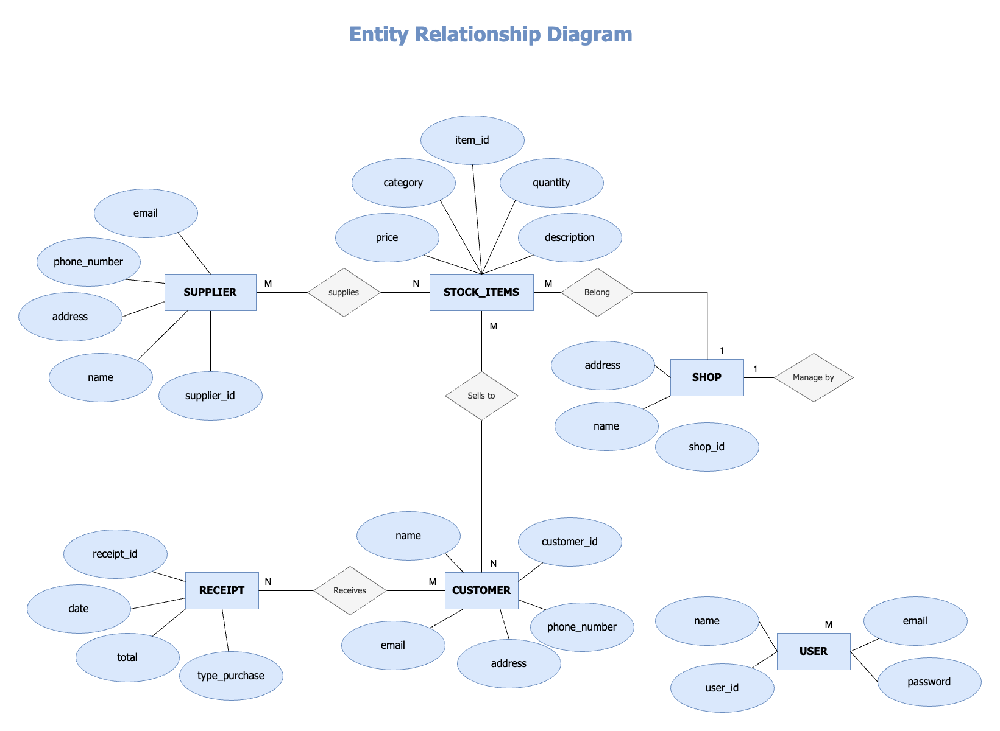
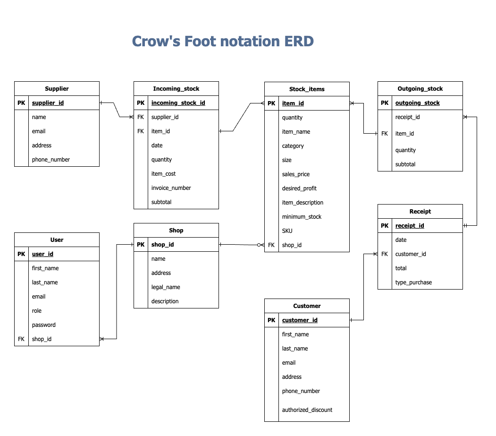

# Inventory Management System
This project will help small family businesses in Mexico to aid in their decision making and strategy. It will be their first step to digitise their current paper-based system to reduce human errors. 


____

# How to

## How to create a virtual env

```
python -m venv .venv 
```

## How to enter to the virtual env
```
source ./.venv/bin/activate
```
____


## Database and user creation

Mac users

```
 psql
```

Linux & WLS users

```
sudo -u postgres psql
```
### Create the database in PostgreSQL

```
CREATE DATABASE db_name;
```

Connect to the database:
```
\c db_name;
```

Create a user to manage this database:
```

CREATE USER username WITH PASSWORD 'password';
```

and grant all permission to the user:
```
GRANT ALL PRIVILEGES ON DATABASE db_name TO username;
```


Link ypur personal db with the app:

1. Create a new file (.env) 
2. Store the URL of the database in  "DATBASE_URL = " 
3. Store your JWT secret key in "JWT_SECRET_KEY ="

flask --app src/main run 
or 
```cd src 
flask run
```

Grant permision to public schema to user:
```
GRANT ALL ON SCHEMA public TO username;
```


## Features/Capabilities: 

- CRUDs incoming and outgoing stock
- CRUDs price lists
- Reports current stock levels by customer
- Reports current stock levels by supplier
- Reports order volume in monetery terms by customer within a date range
- Reports order volumes by supplier (optionally and additionally by product) within a date range
- Creates electronic receipts


## Project Requirement

### R1. Problem identification 

### R2. Project justification


### R3. PostgreSQL as DBMS for the project. 


Choosing the right database management system (DBMS) is critical to developing effective web applications. Although there are many database management systems (DBMS) with different properties and structure types (relational, hierarchical, networked, object-oriented), I decided to use a relational DBMS for this project because it has great advantages, such as:

* Manage data integrity and accuracy.
* Minimize data redundancy.
* Enables data scalability and flexibility.
* Facilitate the implementation of security measures.

There are several reliable and widely used relational database management systems (RDBMS), some of which are compatible with Flask, the web framework used in this project, are listed below:


a) SQLite: a file-based serverless DBMS is suitable for small applications and test environments.
b) MySQL: a popular open source DBMS known for its performance, scalability, and ease of use.
c) PostgreSQL: an open source DBMS known for its robustness, reliability and wide range of features. 

However, the latter is the one that is most aligned with the needs of the project. PostgresSQL has many advantages such as:

* **Robustness and Reliability:** PostgreSQL is known for its stability and data integrity features, ensuring that enterprise data remains secure and consistent.

* **Extensive Feature Set:** PostgreSQL offers a wide range of advanced features, such as support for complex queries, indexing options and spatial data capabilities. These features enable efficient data retrieval and analysis.

* **Scalability:** PostgreSQL can handle large amounts of data and adapt to growing business needs. It supports horizontal scalability through replication and partitioning, making it suitable for companies with growth aspirations.

* **Active community and support:** PostgreSQL benefits from an active and vibrant community of developers and users who contribute to its continuous improvement and provide support through forums and documentation.


While PostgreSQL is a robust and versatile choice, it does have some disadvantages compared to other options:

* **Complexity:** Compared to SQLite, PostgreSQL might require additional setup and configuration, making it slightly more complex for beginners. However, this complexity offers greater flexibility and scalability in the long run.

* **Resource Intensive:** PostgreSQL may require more system resources, such as memory and processing power, compared to SQLite. However, this trade-off enables the system to handle larger datasets and complex operations efficiently.

* **Licensing:** Although PostgreSQL is open-source and free, some commercial features, such as advanced security options and tools, require a paid license. However, the free version provides ample functionality.


While PostgreSQL may require more initial configuration and system resources compared to SQLite, these drawbacks are outweighed by the benefits it offers, and it prevails as the best choice for the Inventory Management System project.

________


### R4. Identify and discuss the key functionalities and benefits of an ORM


_________

### R5. Document all endpoints for your API


* **USER**

    - Register new user
    - User login


* **Stock:** /OWNER/

    -  Register new item into the inventory

        stock/ new_item

    - Display all items with their attributes (Read)

        stock/ item_id

    - Update item attributes (Update)

        stock/ item_id / update

    - Delete item (Delete)

        stock/ item_id/ delete

        According to good practice it is not recommended to remove a product, so a new attribute is added to the Stock_items table to change the status of a product that is not sold by the company to discontinued.


* **Customer:**

    - Register new customer in the customer catalogue(C)

        custormer/ new_customer

    - Display all customers in the customer catalogue: (R)

        customer/ all

    - Display a customer from the customer catalogue (R)

        customer/ customer_id

    - Update customer information (U)

        customer/ customer_id/ update


c) **Lista de precio** //STAF//

* Display products and their respective price and number in stock per product category (eg. Water-based paints) (R)

stock/ item_by_category 

* Show the price and stock of a single product (R)

stock/ item_id/ sales_price


d) Reports:

* current stock level (quantity and minimum stock, difference between this 2): (weekly?)
We want to know if we need to buy more and how much of it, help to create purchase order.

stock/ stock_level/ date_rage

* Un reporte de todas Compras que hemos realizado en terminos monetarios por cada proveedor que tenemos (R)


* Un reporte de todas las ventas por mes en terminos monetarios

* Reporte de ventas por clientes (C)


e) **Entradas**

* Entradas de productos + Identificar cambios de en el costo de producto (R)


___________

### R6. Inventory Management System ERD

<br> 

The following diagram was designed as a first step to outline the relationship between the entities that belong to our Inventory Management System.

<br>



Explanation: 

* Many suppliers can supply many items in the stock/ and many items in the stock can be supply by many suppliers.

* A shop can own many stock_items / and many stock_items belong to a shop.

* A shop can be managed by many users of the system/ and many user manage a shop.

* Many stock_items can be sold to many customers/ and many customers can buy many items in the stock.

* Many customers can receive many receipts for their purchases/ and many receipt can be given to many user.

<br>

Following Crow's Foot Notation for the modelling of our database system we have extended some of our entity attributes and added join tables for the normalisation of our data and to avoid many-to-many type relationships betweent the tables.


<br>




<br>

### R7. Detail any third party services that your app will use


### R8. Relationship between models in the inventory management system database


<br>

### R9. Relationships between entities in the ERD-based database of the inventory management system 
Explain the relationships involved in your database based on an ERD that represents the planned database
Discuss the database relations to be implemented in your application


* **Supplier and Incoming_stock**

    One to many: A supplier can have one or more items in the incoming stocks.

* **Incoming_stock and Stock_items**

    One to many: An incoming_stock can have one or more Stock_items.

* **Outgoing_Stock and Stock_items**

    One to many: an Outgoing_stock record can have one or many Stock_items (quantity).

* **Receipt and Outgoing_stock**

    One to many: One receipt can have one or many items from the Outgoing_stock.

* **Customer to Receipt**
    
    One to many: One customer can have one or many receipts.

* **Store and Stock_items**
    
    One to many: One store can have zero or many Stock_items (items in stock).

* **Store and User**
    
    One to many: A shop can be managed by one or many users.


<br>

### R10. Describe the way tasks are allocated and tracked in your project